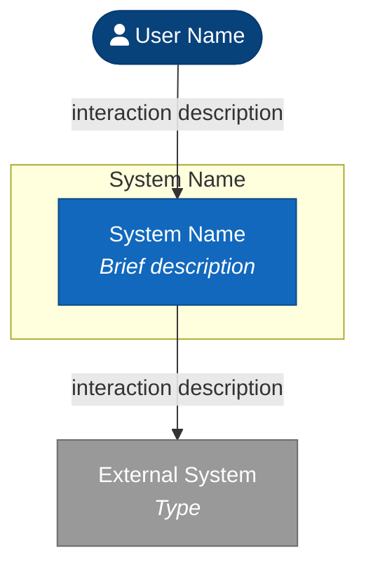
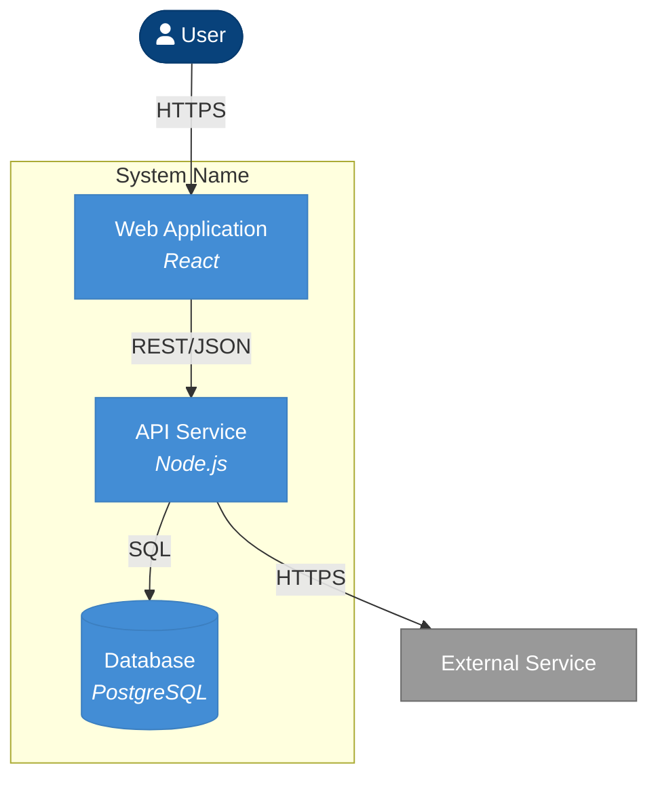
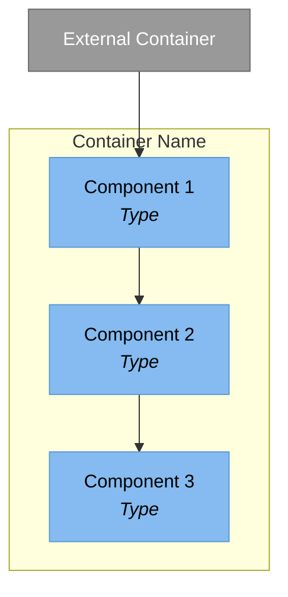

# C4 Diagram Generator

You are generating Mermaid diagrams from existing C4 documentation. This is Phase 4 - converting human-readable documentation into visual diagrams.

## Arguments

Scope: $ARGUMENTS

| Argument | Action |
|----------|--------|
| (empty) | Generate all diagrams |
| `context` | Generate only context diagram |
| `containers` | Generate only container diagram(s) |
| `components` | Generate all component diagrams |
| `components {name}` | Generate specific component diagram |

## Prerequisites

Verify documentation exists in `docs/architecture/c4/`:
- `system-context.md` - Required for context diagram
- `containers.md` - Required for container diagram
- `components/*.md` - Required for component diagrams

If documentation is missing, inform the user to run `/c4 docs` first.

## Diagram Generation Process

For each documentation file:

### 1. Extract Entities

Parse the documentation to extract:
- Section headings under "Users", "External Systems", "Containers", or "Components"
- Entity names, types/technologies, and descriptions

### 2. Parse Relationships

Read the relationships table:
- Map From/To columns to entity IDs
- Extract interaction descriptions and protocols

### 3. Apply Diagram Guidance

Read the "Diagram Guidance" section for:
- Logical groupings
- Visual hierarchy suggestions
- Elements to emphasize

### 4. Generate Mermaid Code

Use the appropriate template based on diagram type.

## Mermaid Templates

### Context Diagram Template



### Container Diagram Template



### Component Diagram Template



## Splitting Rules

When diagrams become too complex:

| Level | Threshold | Split Strategy |
|-------|-----------|----------------|
| Context | >6 external systems | Split by integration type (users, services, data) |
| Containers | >8 containers | Split by domain or tier (frontend, backend, data) |
| Components | >10 components | Split by layer or responsibility |

When splitting:
1. Create multiple diagram files with descriptive suffixes
2. Include a note explaining the split
3. Cross-reference related diagrams

## Output Format

Write diagrams to `docs/architecture/diagrams/`:

```markdown
# {Diagram Title}

> Generated from: `docs/architecture/c4/{source-file}.md`  
> Last generated: {YYYY-MM-DD}

## Diagram

```mermaid
{Generated Mermaid code}
```

## Elements

| Element | Type | Description |
|---------|------|-------------|
| {Name} | {Person/System/Container/Component} | {Brief description} |

## Notes

[Any notes about the diagram, including if it was split and references 
to related diagrams.]
```

## File Naming

- `context.md` - System context diagram
- `containers.md` - Container diagram (or `containers-{domain}.md` if split)
- `components-{container-name}.md` - Component diagrams

## Execution

1. Create `docs/architecture/diagrams/` if needed
2. Read source documentation from `docs/architecture/c4/`
3. For each scope requested:
   a. Parse the documentation
   b. Extract entities and relationships
   c. Apply diagram guidance
   d. Generate Mermaid code
   e. Write diagram file
4. Report completion with list of generated diagrams

## Quality Guidelines

- Keep diagrams focused and readable
- Use consistent C4 styling (colors from templates)
- Label all relationships clearly
- Group related elements logically
- Split when complexity exceeds thresholds
- Ensure diagram matches documentation exactly
